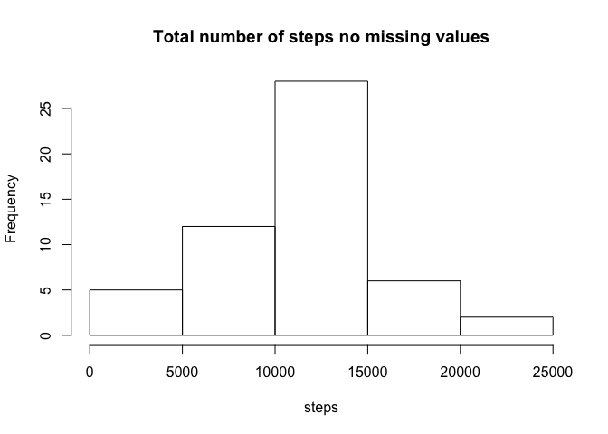

# Reproducible Research: Peer Assessment 1


## Loading and preprocessing the data


```r
unzip( "activity.zip")
activity<- read.csv("activity.csv")
head(activity)
```

```
##   steps       date interval
## 1    NA 2012-10-01        0
## 2    NA 2012-10-01        5
## 3    NA 2012-10-01       10
## 4    NA 2012-10-01       15
## 5    NA 2012-10-01       20
## 6    NA 2012-10-01       25
```

## What is mean total number of steps taken per day?

```r
totalstepsday  <- aggregate(data= activity,steps~date, sum, na.rm=TRUE)
head(totalstepsday)
```

```
##         date steps
## 1 2012-10-02   126
## 2 2012-10-03 11352
## 3 2012-10-04 12116
## 4 2012-10-05 13294
## 5 2012-10-06 15420
## 6 2012-10-07 11015
```


```r
hist(totalstepsday$steps, main="Total number of steps", xlab="steps")
```

 


```r
mean(totalstepsday$steps)
```

```
## [1] 10766.19
```

```r
median(totalstepsday$steps)
```

```
## [1] 10765
```

## What is the average daily activity pattern?


```r
stepsandinterval <- aggregate(steps ~ interval, activity, mean)
```


```r
plot(stepsandinterval, type='l')
```

 


```r
stepsandinterval$interval[which.max(stepsandinterval$steps)]
```

```
## [1] 835
```


## Imputing missing values
Total number of missing values

```r
sum(is.na(activity$steps))
```

```
## [1] 2304
```

Filling missing values:


```r
activity2 <- merge(activity, totalstepsday, by="date", suffixes=c("", ".mean"))
onlynas <- is.na(activity2$steps)
activity2$steps[onlynas ] <- activity2$steps.mean[onlynas ]
activity2<- activity2[, c(1:3)]
head(activity2)
```

```
##         date steps interval
## 1 2012-10-02     0     1740
## 2 2012-10-02     0     1715
## 3 2012-10-02     0     1725
## 4 2012-10-02     0     1710
## 5 2012-10-02     0     1735
## 6 2012-10-02     0     1855
```


```r
totalstepsday2  <- aggregate(data= activity2,steps~date, sum, na.rm=TRUE)
head(totalstepsday2)
```

```
##         date steps
## 1 2012-10-02   126
## 2 2012-10-03 11352
## 3 2012-10-04 12116
## 4 2012-10-05 13294
## 5 2012-10-06 15420
## 6 2012-10-07 11015
```


```r
hist(totalstepsday2$steps, main="Total number of steps no missing values", xlab="steps")
```

 


## Are there differences in activity patterns between weekdays and weekends?


